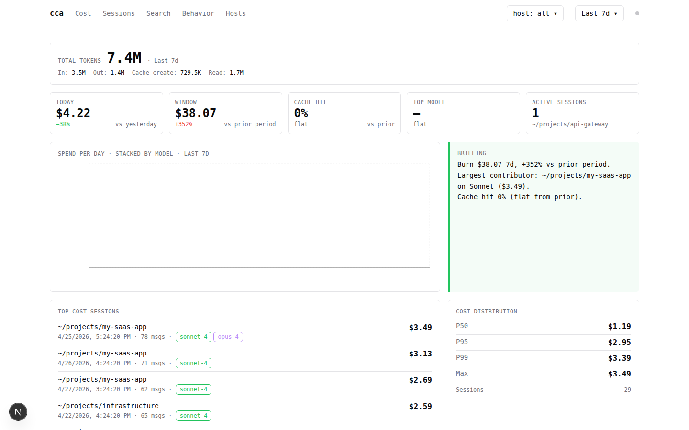
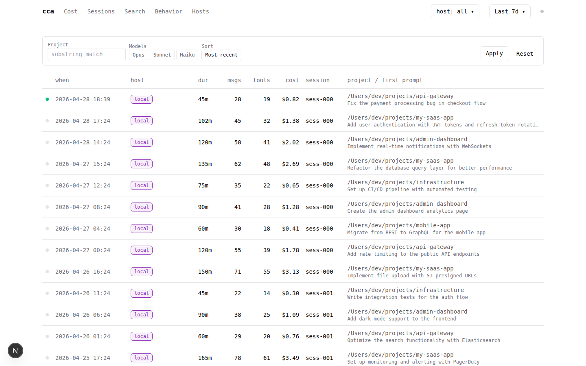
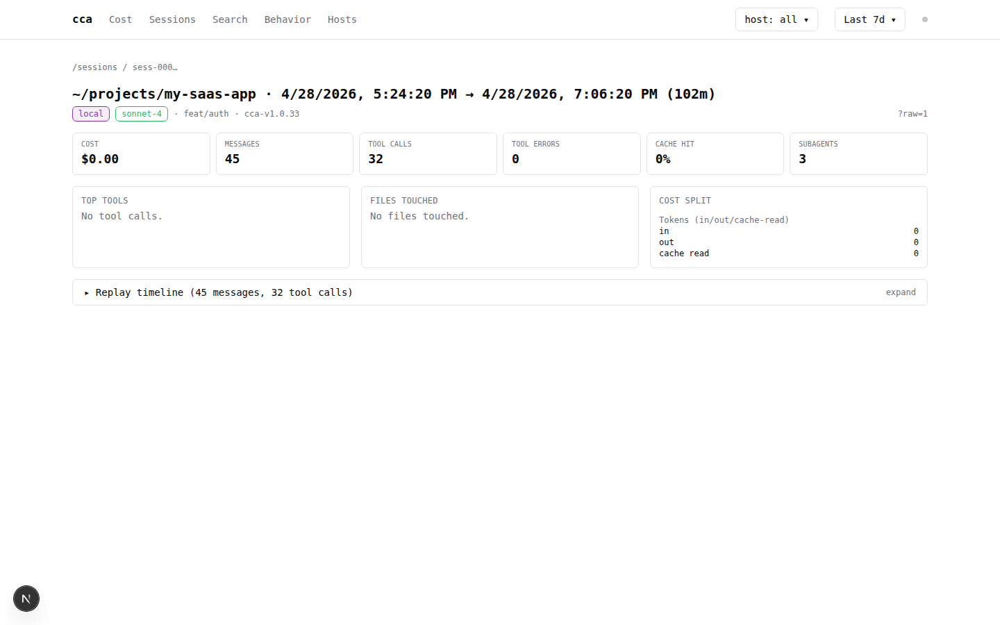

# Claude Code Analytics (`cca`)

Local-first observability for [Claude Code](https://claude.com/claude-code) sessions.

`cca` watches `~/.claude` in real time — JSONL transcripts, hooks, history, todos, file snapshots — ingests everything into Postgres on your machine, and gives you a CLI + web dashboard to review usage, replay sessions, search transcripts, and track cost.

**No cloud. No API keys. No telemetry.** Your data stays on `localhost`.

### Dashboard

<p align="center">
  
</p>

<p align="center">
  
  
</p>

---

## What you get

| Component | What it does |
|---|---|
| **Ingester** | `chokidar` daemon watches `~/.claude`, parses events in real time |
| **CLI** | `cca status`, `cca sessions`, `cca replay`, `cca search`, `cca stats` |
| **Web dashboard** | Next.js app on `:3939` — cost tracking, session replay, full-text search, behavior trends |

### Dashboard views

- **`/`** — Cost command center: spend by model, KPI strip, top-cost sessions, cache hit trends, hour×day heatmap
- **`/sessions`** — Paginated session list with project/model filters
- **`/session/<id>`** — Full session replay with cost breakdown and tool timeline
- **`/search`** — Full-text search with highlighted snippets
- **`/stats`** — Behavior analytics: tool error rates, latency percentiles, token velocity

---

## Architecture

```
~/.claude/
   ├─ projects/*.jsonl     (turn-by-turn events)
   ├─ history.jsonl, todos/, ...
   │
   ▼   chokidar tailer + parsers
┌──────────────┐
│  cca daemon  │  :9939  ──► /status, /hook, /events (SSE)
└──────┬───────┘
       │ writes
       ▼
┌──────────────┐
│  Postgres    │  :54322
│  claude_code │
└──────┬───────┘
       ├──► cca CLI (terminal)
       └──► Next.js web UI (:3939)
```

Two long-running processes: the **daemon** (Node, ingest) and the **web** (Next.js, UI). Both auto-start via `~/.zshrc` snippets on first terminal open after login.

---

## Quick start

**Prerequisites:** Node 22+, pnpm 9+, Postgres 17 on `localhost:54322`.

```bash
# Clone and install
git clone https://github.com/aporb/ClaudeCode_Analytics.git
cd ClaudeCode_Analytics
pnpm install

# Configure (defaults work as-is)
cp .env.example .env.local

# Set up database
psql "$CCA_DATABASE_URL" -f infra/docker/create-db.sql
pnpm db:migrate
pnpm db:seed

# Import existing Claude Code history
pnpm backfill

# Install the Claude Code hook for live ingestion
./scripts/install-hooks.sh

# Start the dashboard
pnpm cca open
```

No Postgres yet? Standalone container:

```bash
docker compose -f infra/docker/docker-compose.yml up -d
```

---

## CLI reference

```bash
cca status              # event/session/active counts
cca sessions --limit 10 # recent sessions with cost
cca replay <session>    # full timeline (turns + tool calls)
cca search "query"      # full-text search with highlights
cca stats --since 30d   # top models, projects, tools
cca tail                # live SSE stream from the daemon
cca open                # open web dashboard in browser
```

---

## Multi-host sync

Pull transcripts from remote machines via SSH+rsync and view everything in one dashboard. Each row is tagged with a `host` column.

```bash
# Configure remotes in cca.remotes.json (gitignored)
[{"host": "my-server", "ssh": "ssh_alias", "claudeHome": "~/.claude"}]

# Sync
cca sync                       # all due hosts
cca sync --force --host my-server  # force one host now
```

See [docs/superpowers/](./docs/superpowers/) for full sync configuration, scheduled cadence, and troubleshooting.

---

## Project structure

```
apps/
├── cli/          @cca/cli — terminal client
├── ingester/     @cca/ingester — daemon + backfill + SSH sync
└── web/          @cca/web — Next.js dashboard

packages/
├── core/         @cca/core — shared types, path utilities
├── db/           @cca/db — Drizzle schema, migrations, seed
└── parsers/      @cca/parsers — pure parsers for ~/.claude files

infra/
├── docker/       standalone Postgres 17 container
├── hooks/        Claude Code hook helpers
└── launchd/      macOS plist templates

docs/
└── superpowers/  design specs and build plans
```

---

## Development

```bash
pnpm test                     # ~113 core tests
pnpm --filter @cca/web test   # ~66 web tests
pnpm typecheck                # all workspaces
pnpm lint                     # Biome (not ESLint/Prettier)
```

**Stack:** pnpm monorepo, TypeScript strict, Drizzle ORM, Vitest, Next.js 16, Biome.

**Note:** macOS-specific. Auto-start uses launchd + zshrc. Linux would need systemd equivalents. Postgres 17 required.

---

## Operational docs

Detailed runbooks live in the repo rather than the README:

- **Auto-start setup** — `.zshrc` snippets for daemon + web ([Auto-start](#auto-start-1) in the full docs)
- **Scheduled sync** — launchd plist that runs every 3h with per-host backoff
- **Recovery** — what to do when ingestion stops
- **Drizzle workaround** — `.ts` import extensions for drizzle-kit compatibility

See [docs/superpowers/specs/](./docs/superpowers/specs/) and [docs/superpowers/plans/](./docs/superpowers/plans/) for the full design and build history.

---

## License

[MIT](./LICENSE) © 2026 Amyn Porbanderwala
